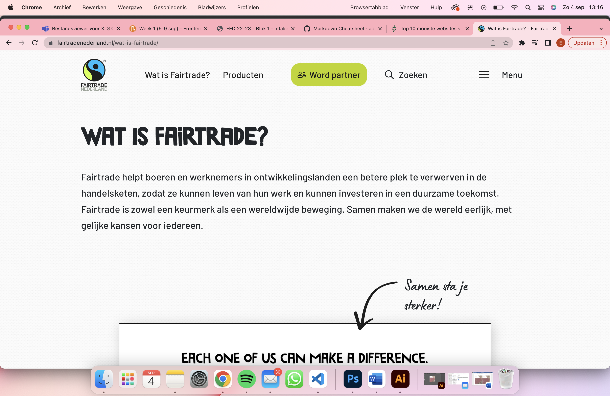
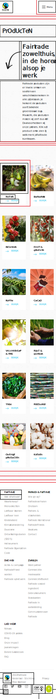

# Procesverslag
Markdown is een simpele manier om HTML te schrijven.  
Markdown cheat cheet: [Hulp bij het schrijven van Markdown](https://github.com/adam-p/markdown-here/wiki/Markdown-Cheatsheet).

Nb. De standaardstructuur en de spartaanse opmaak van de README.md zijn helemaal prima. Het gaat om de inhoud van je procesverslag. Besteedt de tijd voor pracht en praal aan je website.

Nb. Door *open* toe te voegen aan een *details* element kun je deze standaard open zetten. Fijn om dat steeds voor de relevante stuk(ken) te doen.

## Jij

  
uitwerken voor kick-off werkgroep

  ### Auteur:
  Eefje Snel

  #### Je startniveau:
  Blauw (+ klein beetje rood)

  #### Je focus:
  Surface plane
 

## Je website

  
uitwerken voor kick-off werkgroep

  ### Je opdracht:
  https://www.fairtradenederland.nl/

  #### Screenshot(s) van de eerste pagina (small screen): 
  Fairtrade word partner  
  

  #### Screenshot(s) van de tweede pagina (small screen):
  Fairtrade producten  
  
 

## Toegankelijkheidstest 1/2 (week 1)

  
uitwerken na test in 1e werkgroep

  ### Bevindingen
  Lijst met je bevindingen die in de test naar voren kwamen:
  Ik had een begrafenis op de dag van de tests. Thuis heb ik de tests geprobeerd na te bootsen.

  #### Screenreader
  Ik ben zelf niet ervaren met screenreaders maar na verloop van tijd werd het duidelijker en makkelijker te gebruiken.
  Wat me opviel is de headings die als vragen zijn gesteld, zijn moeilijker te begrijpen met een screenreader. 
  Verder staan er te veel headings op de website, die allemaal worden uitgesproken door de screenreader.
  Daarnaast hebben veel afbeeldingen en video's geen alt-teksten en worden dus niet omschreven. Dit voelde voor mij vrij frustrerend omdat de stem 
  voorlas dat er een afbeelding was maar vervolgens krijg ik geen informatie of een idee van diezelfde afbeelding.

  Het lijkt me handig om de headings te veranderen naar standaard woorden of zinnen i.m.v. vragen. 
  Door semantische html te schrijven kan ik voorkomen dat elke tekst wordt uitgesproken door de screenreader. Daarnaast verkom ik er ook mee
  dat de afbeeldingen en video's geen alt-tekst hebben.

  #### Muis en Toetsenbord 
  Met tab en pijltjes had ik de Fairtrade site getest met een vrij schokkend resultaat. Om te beginnen werd bij elk filmpje moest je als gebruiker door alle verschillende buttons en links bewegen en kon je deze niet overslaan. Maar wat vooral erg tegenviel was dat alle headings standaard werden overgeslagen en die op geen enkele manier gereikbaar waren voor alleen toetsenbord. Na het laaste filmpje op de pagina, sprong de site direct naar de footer en sloeg de rest over. 

  Het is naar mijn mening erg belangrijk op alle headings bereikbaar te maken en om de buttons en links in video's te kunnen overslaan. Dit maakt de navigatie door de site een stuk soepeler. Hoe ik dat moet doen weet ik nog niet helemaal en zou ik graag willen vragen in het eerst voortgangsgesprek. 

  #### Motoriek (shocks, elastiekjes)
  Ik had geen apparaatje kunnen gebruiken om een goede weergave te geven van een gebruik van een computer met de ziekte van Parkinson. 
  Wel had ik gelukkig een lieftallige huisgenoot die aan mijn hand schudde om toch nog een (misschien niet al te realistische) test te kunnen doen.
  Het bleek dat de Fairtrade website behoorlijk inclusive is voor mensen met de ziekte van Parkinson.
  De buttons en links zijn groot en zijn erg goed klikbaar. Ook als de muis trilt, klik je 7 uit de 10 keer juist.

  Wat misschien nog wat beter kan is dat bij buttons en links die wat aan de kleine kan zijn, toch nog iets meer ruimte geven.
  Of er wat ruimte omheen die niet zichbaar is maar wel klikbaar. 

  #### Visueel (brillen, contrast, kleurenblind, dark/light). 
  Ik had ook helaas geen mooie brillen om meerdere beperkingen te kunnen na bootsen, wel had ik een enorm versterkte bril van mijn ouders ;) en gelukkig een vriend met kleurenblindheid. 
  Het lettertype van de Fairtrade website is groot maar erg vet, Het feit dat het groot is helpt met de leesbaarheid maar de vetheid spreekt dat weer tegen. Verder is de letter-spacing vrij dichtbij elkaar, dit maakt het ook minder leesbaar voor mensen met een minder goed zicht.
  Over het algemeen is het contrast vrij goed om de site, op sommige plekken is er iets minder contrast waar de vriend met kleurenblindheid ook last van had. Verder vond hij de site vrij duidelijk. 

  Door goed na te denken over contrast en een lettertype te kiezen die wat meer open is, kan ik de meeste problemen verhelpen. Mijn focus punt hier is om voor duidelijkheid te zorgen.

## Breakdownschets (week 1)

  
De breakdownschetsen vond ik nog vrij moeilijk te maken. Dat kwam vooral omdat de site af en toe wat aangepast moest worden, hierdoor wist ik niet altijd meteen wat ik moest neerzetten. Ik heb de meeste dingen in de breakdownschets gezet, waarschijnlijk missen er nog wat onderdelen maar ik hoop dat bij te kunnen werken in de html.

  ### de hele pagina: 
  

  ### de hele pagina: 
  

  ### dynamisch deel (bijv menu): 
  

  ### wellicht nog een dynamisch deel (bijv filter): 
  

## Voortgang 1 (week 2)

  
uitwerken voor 1e voortgang

  ### Stand van zaken
  De html opzetten ging vrij goed, wat ik wel moeilijk vind is het correct semantisch schrijven. Dit hebben we wel geleerd maar ik weet de juiste attributen niet. Soms weet ik bijvoorbeeld niet hoe ik alt-text toevoeg of hoe ik iets de optie kan geven om het over te slaan. Verder heb ik een aantal fouten in mijn site gevonden maar ik weet nog niet helemaal hoe ik dat het best kan verbeteren, ik hoop daar een plan of een handige tip voor de te kunnen maken/vinden. 

  ### Agenda voor meeting
  samen met je groepje opstellen

  | Eefje                          | Nicole                     | Donny                          |
  | ---                            | ---                        | ---                            |
  | Verbeteringen site             | Verbeteringen site         | Hoe werken de css selectors    |
  | Semantische html opzetten      | Opzetten van html          | Waar moet ik alles uploaden    |
  | Footer                         |                            |                                | 

  ### Verslag van meeting
  hier na afloop snel de uitkomsten van de meeting vastleggen

  - punt 1: Er zijn een aantal punten op de huidige site die niet al te best zijn en die ik graag wil verbeteren. Ik had moeite met keuzes maken over hoe ik die problemen moest oplossen. Hierbij ben ik     geholpen, voornamelijk met het probleem bij het menu.
  - punt 2: Ik wilde de site qua toegankelijkheid verbeteren, ik had wat vragen gesteld over bepaalde attributes. Ik kreeg fijne antwoorden waar ik later meer mee kan.
  - punt 3: Ik had een probleem met de heading levels maar die lostte zich vanzelf op.

## Voortgang 2 (week 3)

  
uitwerken voor 2e voortgang

  ### Stand van zaken
  Ik heb voornamelijk veel tijd gestoken in het oefenen met js en animaties. Ik ben niet veel verder gekomen met mijn site, maar de js is nu wel gelukt en is volledig resonsive. Dit was een groot opstakel voor mij dus ik ben blij dat achter de rug te hebben.

  ### Agenda voor meeting
  samen met je groepje opstellen

  | Eefje          | Donny                        | Nicole                                                 | 
  | ---            | ---                          | ---                                                    |
  | tijd inhalen   | HTML class aan js koppelen   | Nicole heb ik niet kunnen spreken voor deze meeting    | 
  |                |                              |                                                        |
  | ...            |                              |                                                        | 

  ### Verslag van meeting
  hier na afloop snel de uitkomsten van de meeting vastleggen

  - punt 1: Mijn enige punt deze week was het bijwerken en zorgen dat ik genoeg had om in te leveren aan het eind van het vak. Ik kreeg meteen als antwoord dat dat absoluut mogelijk is en dat ik het zeker nog ga halen als ik genoeg tijd en aandacht in de website steek. Dit hielp mij enorm, ik was even de draad kwijt en gelukkig werd deze mij aangerijkt.

## Toegankelijkheidstest 2/2 (week 4)

  
uitwerken na test in 8e werkgroep

  ### Bevindingen
  Dit was mijn eerste test die ik op school heb gedaan. De gene hiervoor was met behulp van mijn huisgenoot thuis uitgevoerd. Ik merkte dat er gelukkig niet erg veel verschil zat tussen de efficiëntie van beide tests.

  #### Screenreader
  Ik vind het gebruiken van een screenreader niet bepaald makkelijk maar gelukkig was het al een enorme verbetering ten opzichte van de huidige fairtrade site. In de site die ik heb gemaakt kan er gemakkelijk door de navigatie gegaan worden en zijn er niet overweldigend veel links om doorheen te gaan. Ook zijn de links in de content nu gemakkelijker te bedienen. De video en de navigatie in de footer zijn wel nog moeilijk. Elke link wordt uitgesproken wat vrij verwarrend kan zijn. Ik heb meerdere keren gevraagd over skiplinks maar dat was nog wat te moeilijk. Ik kijk in het verloop van dit vak of ik dat nog kan toevoegen. Niet alles had (de juiste) alt-text, dit heb ik meteen aangepast. 

  #### Muis en Toetsenbord 
  Door de site bewegen is een stuk gemakkelijker geworden in mijn re-design. Het was een beetje puzzelen met hoe alles bedient moest worden maar de focus-states zijn aanwezig en vallen goed op.

  #### Motoriek (shocks, elastiekjes)
  De motorieke kant van de huidige fairtrade website was vrij goed uitgewerkt. De buttons waren groot genoeg om op te klikken en de site is over het algemeen zo ingericht dat je er goed doorheen kan gaan zonder gekke dingen. Mijn doel hierbij was dit behouden, misschien hier en daar wat verbeteren maar het was al vrij goed. Uit de test bleek dat sommige buttons en links wel wat klein waren. Deze heb ik later nog wat groter gemaakt.

  #### Visueel (brillen, contrast, kleurenblind, dark/light). 
  Om eerlijk te zijn had ik weinig moeite met het zien door de brillen, maar door mijn ogen samen te knijpen kreeg ik een beter idee van de site. Ook mijn partner heeft meegekeken en hij was het eens met mijn bevindingen. Voor kleurenblinde mensen is de site toegankelijk en kan het goed gebruikt worden. Ook mensen die moeite hebben met contrast zien, zullen geen/nauwelijks moeite hebben met de site. Wel waren er een aantal onderdelen die wat wegvielen, deze heb ik snel een andere kleur of grootte gegeven. 

## Voortgang 3 (week 4)

  
uitwerken voor 3e voortgang

  ### Stand van zaken
  Ik heb de afgelopen week de gehele vormgeving van mijn site omgegooid. Ik kwam erachter dat ik wel de huisstijl kleuren gebruikte maar volledig afweek van de sfeer dat het bedrijf heeft.

  ### Agenda voor meeting
  samen met je groepje opstellen

  | Eefje                                                       | Donny                             | Nicole                                                 | 
  | ---                                                         | ---                               | ---                                                    | 
  | Ik wil graag een simpele skiplink maken.                    | Donny wil bezig met positions     | Nicole heb ik niet kunnen spreken voor deze meeting    |
  | Ik vind het moeilijk om te beginnen met mijn tweede pagina. | tekst verschijnen en verdwijnen   |                                                        |
  | ...                                                         | classes                           |                                                        | 

  ### Verslag van meeting
  hier na afloop snel de uitkomsten van de meeting vastleggen

  - punt 1: De skiplink is nog niet gelukt. Misschien kan dat nog komen maar het lukt me nog niet. 
  - punt 2: Het beginnen met de tweede pagina is direct na de meeting van start gegaan en ging vrij soepel. Ik kreeg goede tips en er werd me verzekerd dat het gebruiken van een class geen probleem is voor een tweede pagina.

## Eindgesprek (week 5)

  
uitwerken voor eindgesprek

  ### Je uitkomst - karakteristiek screenshots:
  
  
  

  En nog veel meer mooie dingen natuurlijk!

  ### Dit ging goed/Heb ik geleerd: 
  Ik ben meer gaan begrijpen hoe html en css in elkaar zitten en daarmee begrijp ik nu ook beter hoe ik kan designen voor toegankelijkheid.
  Ondanks dat dit vak nauwelijks over javascript gaat, ben ik toch iets comfortabeler meer geworden.
  Verder heb ik geleerd om met html en css hele leuke animaties te maken! Ik vind het heel leuk om te doen en het voegt echt wat toe.

  

  ### Dit was lastig/Is niet gelukt:
  Ik vind het jammer dat het me nog niet gelukt ik om een skiplink in te voegen. Ik ga dit zometeen nog 1 laatste poging geven maar of het nou lukt of niet. Ik vind het iets lastigs.
  Verder had ik ook moeite met het responsive maken van de site. Dit is niet mijn gekozen onderwerp maar ik wilde toch graag een nette schaalbare website maken. Dit was moeilijker dan ik dacht.

  

## Bronnenlijst

  
continu bijhouden terwijl je werkt

  Nb. Wees specifiek ('css-tricks' als bron is bijv. niet specifiek genoeg).

  1. unsplash voor alle foto's die er te zien zijn op de site. Dit is een website waar je gratis foto's kan downloaden zonder plagiaat te plegen.
  2. flaticon voor alle icoontjes. Ook deze site is gratis en zonder plagiaat.
  3. cubic-bezier.com als een cubic-bezier generator. Deze heb ik gebruikt bij animaties.
  4. 9elements.github.io als een border-radius generator. Met deze site heb ik alle gekke illustraties kunnen maken.
  5. cssgradient.io als een gradient generator. Deze is terug te zien in het pompoentje linksbovenin op de site.
  6. coolors.co als color generator. Hier kon ik gemakkelijk allerlei kleuren genereren maar ook naast elkaar zetten om de leesbaarheid te vergelijken.
  7. pixabay.com voor een gratis korte audia voor de halloweenstate.
  8. Stackoverflow questions om een minimum font-size in te stellen.
  9. html-css-js.com als een box-shadow generator. Hier heb ik ook de styling van de link border vandaan.
  10. hubspot.com 24 creative css animation examples. Ik heb voorbeeld 8 gevolgd, niet precies hetzelfde nagemaakt maar wel als rode draad gebruikt.
  11. w3schools flip card om de kaarten op de productenpagina te kunnen draaien (alleen de html). De javascript heb ik er zelf aan toegevoegd.
  12. youtube Change Image using Onclick. Simple Js tricks door simple codes om een image te veranderen in de halloweenstate. (katarina had deze mij meegegeven)

